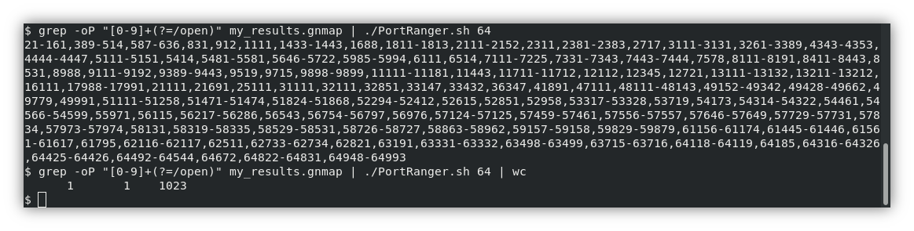
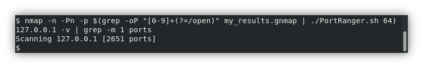
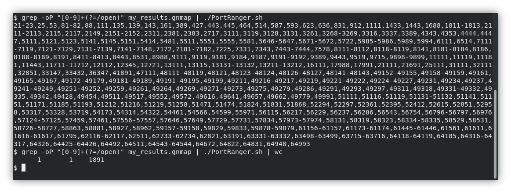

# PortRanger

PortRanger converts an unordered list of ports on separate lines, which may contain duplicates, to a more condensed, comma-separated list of port ranges without duplicates in ascending numerical order.



## Overview

PortRanger is useful when you need ports in a range format for reporting, or where you have limited space. A typical example of a use is to produce a shorter port list that will fit under the Nessus limit of 1024 characters for specifying a custom list of ports to scan.

## Command-line arguments

When no arguments are supplied, PortRanger merges only consecutive port numbers into ranges. If the default output contains too many characters, PortRanger allows you to extend the ranges to produce a shorted list. This is done by supplying an integer greater than 1 as a command line argument.

Alternatively, PortRanger can be used with a command-line argument of `0`, which prevents even consecutive numbers from being merged, so no ranges will be produced. This produces the same output as something like:

```
cat unordered_port_list | sort -un | paste -sd,
```

## Examples

By default, providing this port list to PortRanger:

```
1
2
3
5
10
```

would produce the following output:


```
1-3,5,10
```

But with an argument of `2`, it would produce:

```
1-5,10
```

And with an argument of `5`, it would produce:

```
1-10
```

## Usage

To provide PortRanger with a list of open ports from some nmap grepage, and get a default range list:

```
grep -oP "[0-9]+(?=/open)" results.gnmap | ./ports-list-to-range.sh
```

Can be used to feed Nessus:



The following screenshot shows usage with the default range, being fed from a large-ish gnmap containing many open ports of which there are 465 unique port numbers.



Also shown in the above screenshot is the number of characters counted with `wc` 1891. This is still to long for Nessus.

The following screenshot shows an argument of 64 being specified, which brings the character count below the 1024 limit.


This potentially means that up to 64 extra ports are being added to the ranges each time, so many ports are now included in the range? The following screenshot uses Nessus to determine that 2651 is the new total.


So the 64-span ranges have added over 2500 ports. It is approximately 6 times as many. However, 65535 ports would be approximately 160 times as many. So the net-gain from PortRanger is still considerable. It is also a quick and convenient way of cramming all those ports into Nessus!

## Contributions

Your feedback and contributions will be appreciated.

## Roadmap

- [ ] Port and character stats/counter
- [ ] Automatically parse open ports from gnmap files
- [ ] Add function to automatically produce a range list which contains fewer characters than a specified limit.
    - E.g. `--limit 1024`
- [ ] Other features and improvements

## License

Copyright (c) Paul Taylor 2018

See LICENSE file for details.

